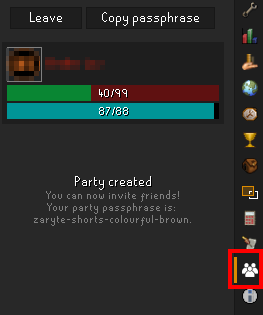
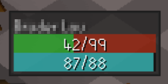

# PartyStatusBarsOverlay
A fully customizable Overlay that renders the Party Members from Runelites PartyService in your game Screen.

The Party Service must be active and you have to be in a Party:

Join a party:

Overlay:

Settings:

