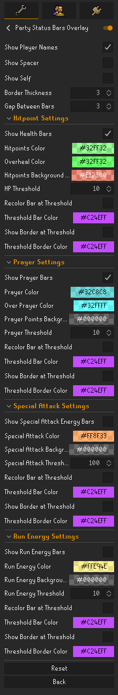

# PartyStatusBarsOverlay

 

A configurable Overlay that renders the Party Members from Runelites PartyService in your game Screen.\
Helps you keep track of your Friends when doing Activities together.

Bars/Characternames can be shown/hidden as needed, colors as well as threshold values for coloring the bars and/or adding a border can be specified.

Hitpoint, Prayer and Run Energy Threshold adds Highlighting when the resource is below the specified value.\
Special Attack Energy Threshold adds Highlighting when the Special Attack Energy is above the specified value.

  

    You have to be a member of a Party:

  

  

Settings:

  

